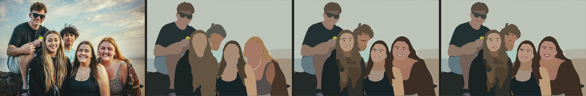
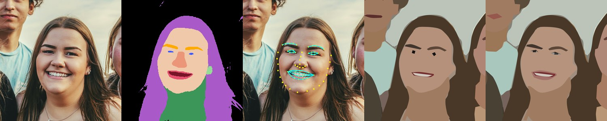
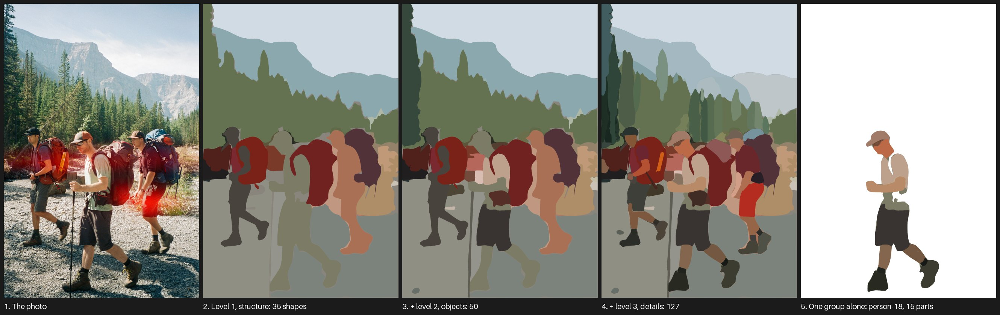
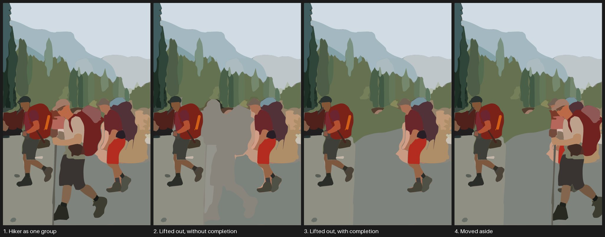

# tracesmart

**Image tracing that understands the picture. It segments the photo with Meta's Segment Anything models (SAM 2.1,
and SAM 3 for things you name) and writes one clean, flat-colour SVG shape per object, not thousands of colour
patches.**


*Left: the photo. Middle: what it found, every shape in its own colour. Right: the result, 127 flat-colour shapes in
a 75 KB SVG. Photo by [Dan Ordze](https://unsplash.com/photos/4GoNeNKEB1M) on Unsplash.*



*And faces: a second stage, `tracesmart faces`, draws eyes, brows, mouths, teeth, glasses and hair on a finished trace.
Left to right: the photo, the trace without faces, cartoon faces, detailed faces. Photo by
[Tim Mossholder](https://unsplash.com/photos/hOF1bWoet_Q) on Unsplash.*

## Why use it

- **One shape per thing.** A hat, a backpack, a window: shapes you can recolour, move or redraw, not fragments. A
  colour-clustering tracer gives about 14,000 patches and 15 MB for the same kind of photo.
- **Tell it what matters.** `--care "window, red shutters, dog"` finds every instance by name, always keeps it, and
  names the shapes (`window-12`) so you can select them all in your editor.
- **Layered for editing.** `--layers objects` nests parts in their object (a hat inside its person) and
  `--layers levels` and `--layers depth` put shapes on Inkscape layers, from coarse to fine or from back to front.
- **Faces.** `tracesmart faces` adds cartoon eyes, brows, mouths, teeth, glasses and hair to a finished trace, on top of
  whatever your `--care` words segmented. It uses face parsing and landmarks, so no extra words are needed.
- **Light.** Typically 50 to 100 KB and 70 to 250 paths.
- **Local.** Runs on your machine, including the Apple GPU. Nothing is uploaded.

**The goal** is a simplified, editable illustration: low on detail, key features kept, flat colours you finish in
Inkscape, Affinity or Illustrator. It is not a pixel-faithful trace. What is still too fine for any segmenter (fur,
foreground grass) you trace by hand on top, in the same file. Faces get their own second stage, below.

## Quick start

Needs Python 3.13 and [uv](https://docs.astral.sh/uv/).

```bash
git clone https://github.com/barton-muller/tracesmart && cd tracesmart && uv sync
uv run tracesmart trace photo.jpg -o out/                                  # automatic
uv run tracesmart trace photo.jpg -o out/ --care "person, hat, backpack"   # plus things you name
```

Open `out/vector.svg`. `out/segments.png` shows what was found (use it to tell segmentation problems from colour
problems) and `out/compare.png` puts the photo, segments and result side by side. All options and files:
[docs/USAGE.md](docs/USAGE.md).

`--care` uses SAM 3, whose weights are gated: request access on the
[facebook/sam3](https://huggingface.co/facebook/sam3) page, accept Meta's licence, then run
`uv run hf auth login` once. Automatic mode does not need it.

## Faces

SAM cannot resolve an eye a few pixels wide, so faces come out blank. `tracesmart faces` runs on a finished trace and
draws eyes, brows, mouths, teeth, glasses and hair as their own named shapes (`face-eye-81`). The default style is a
cartoon face: eyes as dots, a line or a dark open mouth with white teeth, thin brows, no nose. It works with `--care`:
your shapes (person, hand, bag, coat, hair) are kept and the face details go on top of them.



*photo crop · face parsing · landmarks · cartoon · detailed.*

```bash
uv sync --extra faces
uv run --extra faces tracesmart faces photo.jpg out/masks.npz
```

How it works, the examples (with a row for `--care` traces), limits and timings: [docs/FACES.md](docs/FACES.md).

## How it works


1. **SAM 2.1 proposes objects** across the image (a grid of point prompts plus zoomed crops): 202 masks here.
2. **Filter by impact** keeps only masks that earn their place. They are painted large to small in their mean
   colour, and each must measurably reduce the error against the photo. That leaves 139 shapes here.
3. **Gaps are filled**: big badly covered areas are found and SAM 2.1 is prompted there, then filtered again.
4. **`--care` (optional)**: SAM 3 finds every instance of each phrase. Those shapes are always kept, replace
   near-duplicate automatic ones, and are outlined in magenta in the segment map.
5. **Tracing**: each mask becomes one path. Real corners stay sharp (windows stay rectangular) and curves are
   smoothed. Each shape gets the mean colour of its visible pixels.

## Layers, for editing



`--layers levels` puts the shapes on three Inkscape layers, from coarse structure to fine detail; hide the last
layer to simplify the picture. `--layers depth` gives layers from back to front in which no two shapes overlap, the
layering used by Wang et al. (CVPR 2025). A shape's level is how much it reduces the error against the photo,
SAMVG's own measure.

`--layers objects` makes each person one group (shirt, boots, hat, backpack, pole) and extends the ground and
forest under it, so you can lift the hiker out and move them without leaving a hole:



The layers do not change how the picture looks, apart from a pixel or two along shared edges. Details and limits in
[docs/USAGE.md](docs/USAGE.md#layers-for-editing).

## Hardware and speed

Developed and measured on **one machine: an Apple M2 with 16 GB of RAM**.

| | |
|---|---|
| Downloads | SAM 2.1 large about 0.9 GB; SAM 3 about 3.3 GB (only for `--care`) |
| Default run (1024 px, `--grid 32`) | about **4 minutes**, about 1 GB of memory |
| Detailed run (1280 px, `--grid 48`, 3 rounds; the examples' settings) | about **7 minutes**, about 1.5 GB |
| Adding `--care`, masks already cached | about **1 minute** for 3 phrases, a few seconds per extra phrase |
| `rerender`, `index` | seconds, no model |
| `faces` (second stage, five faces) | about **8 seconds** warm, **16** cold, about 1.7 GB; downloads about 0.65 GB (face parser) and 0.1 GB (landmarks) |

- The slow part is SAM 2.1 on the whole image. It is cached in `raw_masks.npz`, so changing `--care`, `--impact`
  or the rendering afterwards does not repeat it.
- The Apple GPU (MPS) is used automatically. CUDA should be picked up by PyTorch but is **untested**. The CPU
  should work but is **untested and expected to be several times slower**.
- Output detail is limited by `--max-side` (default 1024) and by SAM's own mask resolution.

## Examples

Six Unsplash photos, each traced automatically and with `--care` (click through for every panel, the SVGs and the
scores):

<table>
<tr>
<td align="center"><a href="examples/hikers/"><br>hikers</a></td>
<td align="center"><a href="examples/delft-street/"><br>Delft street</a></td>
<td align="center"><a href="examples/oostpoort/"><br>Oostpoort</a></td>
</tr>
<tr>
<td align="center"><a href="examples/mountain-lake/"><br>mountain lake</a></td>
<td align="center"><a href="examples/lone-hiker/"><br>lone hiker</a></td>
<td align="center"><a href="examples/canal/"><br>canal</a></td>
</tr>
</table>

Faces, with the model steps shown for every face: [examples/faces/](examples/faces/) and [docs/FACES.md](docs/FACES.md).

## How it compares


*Photo, VTracer 0.6 (defaults), VTracer 0.6 (tuned to about 130 paths), VTracer 1.0 (watershed, tuned), VTracer 1.0
(colour, tuned), SuperSVG (CVPR 2024, about 130 paths), tracesmart (automatic), tracesmart (`--care`).*

Averages over the six photos:

| Method | Paths | File size | PSNR | SSIM |
|---|---|---|---|---|
| VTracer 0.6, defaults | 14,074 | 15.4 MB | 22.8 | 0.76 |
| VTracer 0.6, tuned to about 130 paths | 129 | 1.5 MB | 15.3 | 0.47 |
| VTracer 1.0, watershed, tuned | 128 | 188 KB | 18.1 | 0.44 |
| VTracer 1.0, colour clustering, tuned | 129 | 626 KB | 18.5 | 0.51 |
| SuperSVG (CVPR 2024) | 128 | 70 KB | 19.1 | 0.44 |
| tracesmart, automatic | 107 | 62 KB | 16.2 | 0.41 |
| tracesmart, `--care` | 128 | 64 KB | 17.0 | 0.41 |

- **By pixel scores tracesmart is near the bottom** at a similar path count: its PSNR (17.0) beats only the tuned
  VTracer 0.6 (15.3), and its SSIM (0.41) is the lowest. PSNR and SSIM reward copying the photo; tracesmart fills
  every shape with one flat colour and drops texture on purpose.
- **VTracer's defaults are not a simplification**: about 14,000 paths and 15 MB per photo, with 0.6 and 1.0 alike.
- **VTracer 1.0 is a big step up from 0.6.** Tuned to about 130 paths its files are 188 KB (watershed) to 626 KB
  (colour clustering) instead of 1.5 MB, and it scores above tracesmart (PSNR 18.1 to 18.5). The watershed mode keeps
  edges such as cloud outlines and you can pick out the hikers, but its boundaries are ragged and parts of a person
  merge; the colour mode is speckled. Its files are still 3 to 10 times the size of tracesmart's.
- **SuperSVG** gives light files and the best PSNR of the tuned methods (19.1), but objects run together in a
  painterly blur: the hikers and the buildings are not clearly separate things.
- **What the scores miss** is whether a shape is an *object*. tracesmart's shapes are a hat, a backpack, a window,
  and with `--care` they are named. That is the thing it is built for, and no score here measures it, so judge it
  from the images.

Close-ups with every shape outlined, the full gallery, caveats and how to reproduce:
[docs/COMPARISON.md](docs/COMPARISON.md).

## Limitations

- SAM 3 finds what you name. Anything you forget to mention that SAM 2.1 also misses is missing.
- Fine texture (fur, foliage, foreground grass) is flattened to a few blobs. Trace those by hand on top.
- Colours are averages, so a black-and-white animal comes out grey. Recolour in your vector editor.
- Described shapes are only as good as SAM 3's masks, which are low-resolution and can be blobby at the edges.

## Related work

This is not a new idea. Turning Segment Anything masks into vector shapes is the SAMVG paper (2023), and others
have built on it. Read from their READMEs and abstracts, **not run** by me except where noted:

- **[KU-MIIL/semantic-svg-generation](https://github.com/KU-MIIL/semantic-svg-generation)** (paper:
  [*Compositional SVG Generation via VLM-Driven Hierarchical Semantic Parsing*](https://arxiv.org/abs/2609.14657))
  is the closest in spirit: a vision-language model (Gemini) names the parts, SAM 3 masks them, vtracer vectorises
  each part and a painter's-algorithm compositor stacks the layers. It is a benchmark and pipeline for icons, emoji
  and illustrations and needs a cloud model. tracesmart targets photos, runs locally, and you supply the names.
- **SAMVG re-implementations** exist as small student repos (for example
  [kevin20010808/MultimediaProcessingTermProject](https://github.com/kevin20010808/MultimediaProcessingTermProject)).
  I did not find a packaged tool.
- **[VTracer](https://github.com/visioncortex/vtracer)** is now at 1.0 (alpha), with a desktop app and newer modes.
  The comparison includes the 0.6.15 Python package and the 1.0 command-line tool's watershed and colour-clustering
  modes; its seam-free cutout mode and the desktop app were not tested.
- **Research methods** such as [AmodalSVG](https://arxiv.org/abs/2604.10940),
  [*Controlling Your Image via Simplified Vector Graphics*](https://arxiv.org/abs/2602.14443),
  [*Layered Image Vectorization via Semantic Simplification*](https://arxiv.org/abs/2406.05404), LIVE and
  [SuperSVG](https://github.com/sjtuplayer/SuperSVG) (the only one I ran) are mostly GPU- or diffusion-heavy.
- **Related tools**: [gimpsegany](https://github.com/Shriinivas/gimpsegany) puts SAM masks into GIMP as raster
  layers, [lang-segment-anything](https://github.com/luca-medeiros/lang-segment-anything) gives text-prompted masks
  without vectors, and Vector Magic, Vectorizer.ai and Illustrator's Image Trace are the commercial tracers.

If you know of something closer, please open an issue.

## Built on SAMVG

The method is a re-implementation of **[SAMVG](https://arxiv.org/abs/2311.05276)** (Haokun Zhu, Juang Ian Chong,
Teng Hu, Ran Yi, Yu-Kun Lai and Paul L. Rosin, *SAMVG: A Multi-stage Image Vectorization Model with the
Segment-Anything Model*, ICASSP 2024). The core ideas come from that paper: using Segment Anything masks as the
shapes of the vector image, **"filter by impact"** to decide which masks matter, and prompting the model again at
badly covered regions. No SAMVG code has been released, so tracesmart is written from the paper, not from its code,
and any shortcomings are ours.

What differs: SAM 2.1 instead of the original SAM; no differentiable-rendering optimisation step (each shape is
simply the mean colour of its visible pixels); **text descriptions with SAM 3** (`--care`) with shapes named after
their phrase, which SAMVG does not have; corner-preserving tracing; a fill for uncovered areas; and optional tone
patches.

The BibTeX entry for citing SAMVG is in [docs/CREDITS.md](docs/CREDITS.md).

## Status

This is a **vibe-coded** project: written with an AI coding assistant (Claude Code) while a human steered and
checked the results by eye. There are fast tests for the plumbing, but nothing automatically checks that the
segmentations are *good*. Expect rough edges and check the output before relying on it.

## Development and credits

```bash
uv run pytest        # fast tests, no models needed
uv run ruff check .
```

Contributor and agent notes are in [CLAUDE.md](CLAUDE.md) (also linked as `AGENTS.md`).

[SAM 2.1](https://github.com/facebookresearch/sam2) and [SAM 3](https://github.com/facebookresearch/sam3) by Meta
(weights under Meta's licences; check them before commercial use), used through Hugging Face `transformers`.
[resvg](https://github.com/linebender/resvg) renders the PNGs. The comparisons use
[vtracer](https://github.com/visioncortex/vtracer) and [SuperSVG](https://github.com/sjtuplayer/SuperSVG). Example
photos are from [Unsplash](https://unsplash.com), credited in [examples/README.md](examples/README.md).
tracesmart itself is MIT licensed (see `LICENSE`).
