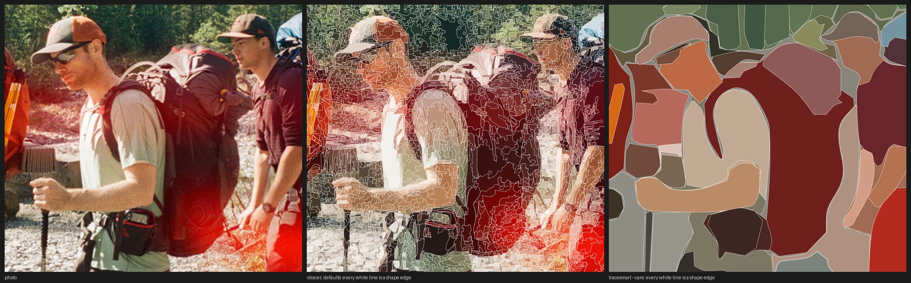
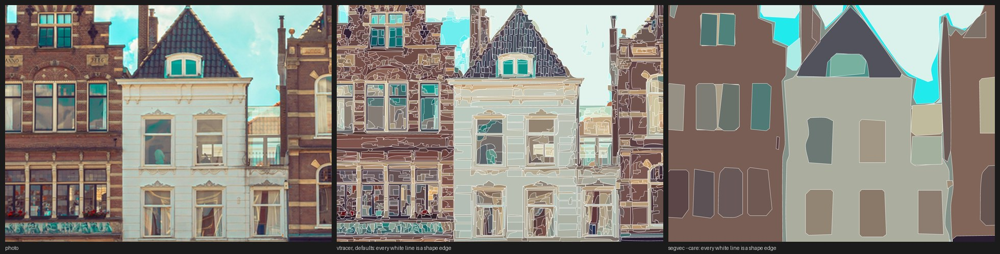

# tracesmart

**Image tracing that understands the picture. It segments the photo with Meta's Segment Anything models (SAM 2.1,
and SAM 3 for things you name) and writes one clean, flat-colour SVG shape per object, not thousands of colour
patches.**

## Goal

Most image-trace tools cluster pixels by colour or follow edges, and turn a photo into thousands of tiny colour
patches. The result looks like the photo, but none of the shapes is a *thing*: a red jumper becomes dozens of
fragments, so you cannot recolour it, move it or redraw it.

tracesmart aims at the opposite: a **simplified, editable illustration** in which each recognisable thing (a
jumper, a window, a roof, a person) is one shape. It is low on detail but keeps the key features, and the shapes are
ready to recolour, rearrange or redraw in Inkscape, Affinity or Illustrator. It is not trying to reproduce the
pixels. Every shape gets one flat colour on purpose, and you finish the colours in your vector editor.

No algorithm knows which details matter to *you*, so you can say so: `--care "window, red shutters, dog"` finds
every instance of those, always keeps them, and names the shapes after what they are (`window-12`) so you can select
them in one go. Whatever is still too fine for any segmenter (fur, foreground grass, faces), you trace by hand on
top, in the same file.

## How it segments, in brief

1. **SAM 2.1** proposes objects across the image (a grid of point prompts, plus zoomed crops).
2. A greedy filter keeps only the masks that earn their place: painted large to small in their mean colour, each
   must measurably reduce the error against the photo.
3. Big areas still badly covered are found and SAM 2.1 is prompted there, then filtered again.
4. Optionally, **SAM 3** finds every instance of each phrase you give it; those shapes are always kept.
5. Each mask becomes one path, with real corners kept sharp and curves smoothed.

Details are under [How it works](#how-it-works).

## Built on SAMVG

The method is a re-implementation of **[SAMVG](https://arxiv.org/abs/2311.05276)** (Haokun Zhu, Juang Ian Chong,
Teng Hu, Ran Yi, Yu-Kun Lai and Paul L. Rosin, *SAMVG: A Multi-stage Image Vectorization Model with the
Segment-Anything Model*, ICASSP 2024). The core ideas come from that paper: using Segment Anything masks as the
shapes of the vector image, **"filter by impact"** to decide which masks matter, and prompting the model again at
badly covered regions. No SAMVG code has been released, so tracesmart is written from the paper, not from its
code, and any shortcomings are ours.

What differs from the paper:

- SAM 2.1 instead of the original SAM, and no differentiable-rendering optimisation step: each shape is simply
  filled with the mean colour of its visible pixels.
- **Text descriptions with SAM 3** (`--care`), with shapes named after their phrase. This is not in SAMVG.
- Corner-preserving tracing (windows stay rectangular), a fill for uncovered areas, and optional tone patches.


*Left to right: the photo, vtracer (default), vtracer (tuned to about 110 paths), SuperSVG (CVPR 2024, about 110
paths), tracesmart (automatic), tracesmart (`--care`). Photo by Dan Ordze on Unsplash.*

## Install

Requires Python 3.13 and [uv](https://docs.astral.sh/uv/).

```bash
git clone https://github.com/barton-muller/tracesmart
cd tracesmart
uv sync
```

Model weights download from Hugging Face on first use: SAM 2.1 large is about 0.9 GB.

### SAM 3 (for `--care`)

The SAM 3 weights (about 3.5 GB) are **gated**. Request access on the
[facebook/sam3](https://huggingface.co/facebook/sam3) model page, accept Meta's licence, then log in once:

```bash
uv run hf auth login
```

Automatic mode does not need SAM 3.

## Use

```bash
# automatic
uv run tracesmart trace photo.jpg -o out/

# plus the things you care about
uv run tracesmart trace photo.jpg -o out/ --care "person, face, hair, jumper, jeans, window, roof"
```

`uv run tracesmart trace --help` lists every option. The ones you will touch most:

| Option | Effect |
|---|---|
| `--care "a, b, c"` | Describe what matters; one SAM 3 prompt per comma-separated phrase |
| `--care-threshold 0.4` | Lower finds more and fainter instances (default 0.5) |
| `--impact 5e-5` | Lower keeps more automatic shapes (default 2e-4) |
| `--grid 64` | Denser SAM 2.1 prompt grid: finds more, slower (default 32) |
| `--max-side 1280` | Resolution the image is processed at (default 1024) |
| `--round-px 0` | Mask smoothing before tracing; 0 gives the crispest shapes |
| `--tone-rms 45` | Split shapes with strong internal colour contrast into tone patches |

### What you get

Everything lands in the output folder:

| File | What |
|---|---|
| `vector.svg` | The result: stacked shapes, bottom first, one path each |
| `vector.png` | The same, rendered at 3x for quick looking |
| `segments.svg` / `.png` | **The segment map**: every shape in its own arbitrary colour, described shapes outlined in magenta. Use it to tell segmentation problems from colour problems |
| `compare.png` | Source, segments and vector side by side |
| `masks.npz` | The masks and their phrases, for `rerender` |
| `raw_masks.npz` | Cached SAM 2.1 masks: rerunning with different `--care`/`--impact` skips the slow stage |
| `run.json` | The settings used and, per phrase, how many instances SAM 3 found |

Colours are intentionally plain averages; recolour in your vector editor.

### Re-render without a model

```bash
uv run tracesmart rerender photo.jpg out/masks.npz --round-px 0
```

### See many runs at once

Lay runs out as `outputs/<image>/<variant>/` and build a page that shows them all:

```bash
uv run tracesmart index --folder outputs
```

## How it works

1. **SAM 2.1 automatic masks** from a point grid plus zoomed crops.
2. **Filter by impact**: masks are painted large to small in their mean colour; one is kept only if it lowers the
   error against the photo by at least `--impact`. Redundant and unimportant masks drop out.
3. **Fill the gaps**: big badly covered regions are found with a distance transform and SAM 2.1 is prompted at
   their centres; the same filter runs again.
4. **Describe** (optional): SAM 3 text prompts. These masks replace near-duplicate automatic shapes and sit in
   area order, so smaller automatic details inside them stay on top.
5. **Trace and stack**: every mask becomes one path (corner-preserving Beziers), each filled with the mean colour
   of its visible pixels.

## Examples

Six Unsplash photos, each traced automatically and with `--care`, and compared with other tools. Every panel of
every example, plus the SVGs and per-photo scores, is in [`examples/`](examples/). Note that `--care` does not always
add shapes: described shapes also replace near-duplicate automatic ones, so the count can go down as the shapes
get better named.

### Hikers


*photo · vtracer (defaults) · vtracer (tuned to the same path count) · SuperSVG · tracesmart (automatic) · tracesmart (`--care`). Photo by [Dan Ordze](https://unsplash.com/photos/4GoNeNKEB1M) on Unsplash. `--care`: person, hat, backpack, shorts, shirt, boot, hiking pole, tree, mountain, sky, gravel path. All panels, SVGs and metrics: [`examples/hikers/`](examples/hikers/).*

### Delft market street


*photo · vtracer (defaults) · vtracer (tuned to the same path count) · SuperSVG · tracesmart (automatic) · tracesmart (`--care`). Photo by [Folco Masi](https://unsplash.com/photos/yvByaC2YqPs) on Unsplash. `--care`: sky, cloud, house, gable, window, roof, door, person, bicycle, lamp, building. All panels, SVGs and metrics: [`examples/delft-street/`](examples/delft-street/).*

### Oostpoort gate, Delft


*photo · vtracer (defaults) · vtracer (tuned to the same path count) · SuperSVG · tracesmart (automatic) · tracesmart (`--care`). Photo by [Alex vd Slikke](https://unsplash.com/photos/GYIGt-MQwZ8) on Unsplash. `--care`: sky, tree, tower, spire, roof, window, chimney, brick wall, arch, bridge, water, road, fence, lamp. All panels, SVGs and metrics: [`examples/oostpoort/`](examples/oostpoort/).*

### Mountain lake


*photo · vtracer (defaults) · vtracer (tuned to the same path count) · SuperSVG · tracesmart (automatic) · tracesmart (`--care`). Photo by [Kalen Emsley](https://unsplash.com/photos/mgJSkgIo_JI) on Unsplash. `--care`: mountain, snow, lake, forest, tree, rock, sky, cloud, person, backpack. All panels, SVGs and metrics: [`examples/mountain-lake/`](examples/mountain-lake/).*

### Lone hiker


*photo · vtracer (defaults) · vtracer (tuned to the same path count) · SuperSVG · tracesmart (automatic) · tracesmart (`--care`). Photo by [Robert Bye](https://unsplash.com/photos/JvUVo08dndQ) on Unsplash. `--care`: person, backpack, shorts, sky, cloud, lake, forest, hill, rock, island, sea. All panels, SVGs and metrics: [`examples/lone-hiker/`](examples/lone-hiker/).*

### Canal and church tower


*photo · vtracer (defaults) · vtracer (tuned to the same path count) · SuperSVG · tracesmart (automatic) · tracesmart (`--care`). Photo by [Casper van Battum](https://unsplash.com/photos/25i3kDguOAE) on Unsplash. `--care`: sky, tree, church tower, clock, building, car, bicycle, bridge, water, road. All panels, SVGs and metrics: [`examples/canal/`](examples/canal/).*

## How it compares

The same six photos traced by [vtracer](https://github.com/visioncortex/vtracer) (a conventional colour-clustering
tracer; colour-clustering tracing is the common approach in image-trace tools) and by
[SuperSVG](https://github.com/sjtuplayer/SuperSVG) (CVPR 2024, a learned vectoriser). vtracer and SuperSVG were
given a path budget close to tracesmart's; vtracer's defaults are shown too. Averages over the six photos
(per-photo numbers in [`benchmarks/RESULTS.md`](benchmarks/RESULTS.md)):

| Method | Paths | File size | PSNR | SSIM |
|---|---|---|---|---|
| vtracer, defaults | 14,074 | 15.4 MB | 22.8 | 0.76 |
| vtracer, tuned to about 115 paths | 116 | 1.6 MB | 17.2 | 0.50 |
| SuperSVG (CVPR 2024) | 115 | 63 KB | 18.8 | 0.43 |
| tracesmart, automatic | 106 | 61 KB | 16.1 | 0.41 |
| tracesmart, `--care` | 128 | 63 KB | 16.9 | 0.41 |

How to read this, honestly:

- **By pixel scores tracesmart comes last** at a similar path count. PSNR and SSIM reward copying the photo;
  tracesmart fills every shape with one flat colour and drops texture on purpose.
- **vtracer's defaults are not a simplification**: about 14,000 paths and 15 MB per photo. Tuned down to about 115
  paths it is speckled, and its files are about 25 times the size of tracesmart's at the same path count (each path
  has many more nodes), which makes them harder to edit.
- **SuperSVG** gives light files and a painterly look, but it blurs objects: the hikers and the buildings are not
  recognisable as separate things.
- **What the scores miss** is whether a shape is an *object*. tracesmart's shapes are a hat, a backpack, a window,
  and with `--care` they are named. That is the thing it is built for, and it is not measured by any score here;
  judge it from the images in [`examples/`](examples/).

### Why does vtracer's default look exactly like the photo?

Because it is made of thousands of tiny shapes. vtracer clusters pixels by colour and traces every cluster, so with
its defaults it produces about 14,000 paths per photo, roughly one per little patch of similar pixels. That is
close to a posterised copy of the photo (hence the high PSNR and SSIM), not a simplified illustration, and each
patch is a fragment of something, not an object. Colour-clustering tracers in general behave this way. Here is the same
region with every shape outlined:





To get the shape count down, vtracer's detail knobs have to be turned until whole regions merge by colour alone,
which is what the "tuned" column does: it keeps the speckle and loses the objects.

Caveats: six photos, one run each; vtracer was tuned by a coarse search on path count only; SuperSVG ran on the
CPU with patches ([`benchmarks/SUPERSVG.md`](benchmarks/SUPERSVG.md)) and its path budget was set from tracesmart's
count before gap-filling shapes were added, so tracesmart has up to a quarter more paths than SuperSVG on some photos.
Reproduce with `benchmarks/compare.py`.

## Limitations

- SAM 3 finds what you name. Anything you forget to mention, and that SAM 2.1 misses, is missing.
- Fine texture (fur, foliage, foreground grass) is flattened to a few blobs. Trace those by hand on top.
- Colours are averages, so a black-and-white animal comes out grey.
- Described shapes are as good as SAM 3's masks, which are low-resolution and can be blobby at the edges.
- The automatic stage takes about a minute or two per image on an Apple M-series GPU.

## Development

```bash
uv run pytest        # fast tests, no models needed
uv run --group bench python benchmarks/compare.py --help   # the comparison
uv run ruff check .
```

## Credits and licences

- [SAM 2.1](https://github.com/facebookresearch/sam2) and [SAM 3](https://github.com/facebookresearch/sam3) by
  Meta, used through Hugging Face `transformers`. Their weights are under Meta's licences; check them before
  commercial use.
- **[SAMVG](https://arxiv.org/abs/2311.05276)**, the method this is built on (see above). Please cite it if you use
  this idea:

  ```bibtex
  @inproceedings{zhu2024samvg,
    title     = {{SAMVG}: A Multi-stage Image Vectorization Model with the Segment-Anything Model},
    author    = {Zhu, Haokun and Chong, Juang Ian and Hu, Teng and Yi, Ran and Lai, Yu-Kun and Rosin, Paul L.},
    booktitle = {ICASSP 2024 - IEEE International Conference on Acoustics, Speech and Signal Processing},
    year      = {2024}
  }
  ```
- SVG-to-PNG rendering by [resvg](https://github.com/linebender/resvg).
- Comparisons use [vtracer](https://github.com/visioncortex/vtracer) and [SuperSVG](https://github.com/sjtuplayer/SuperSVG).
- Example photographs are from [Unsplash](https://unsplash.com); see [`examples/README.md`](examples/README.md) for credits.

tracesmart itself is MIT licensed (see `LICENSE`).
