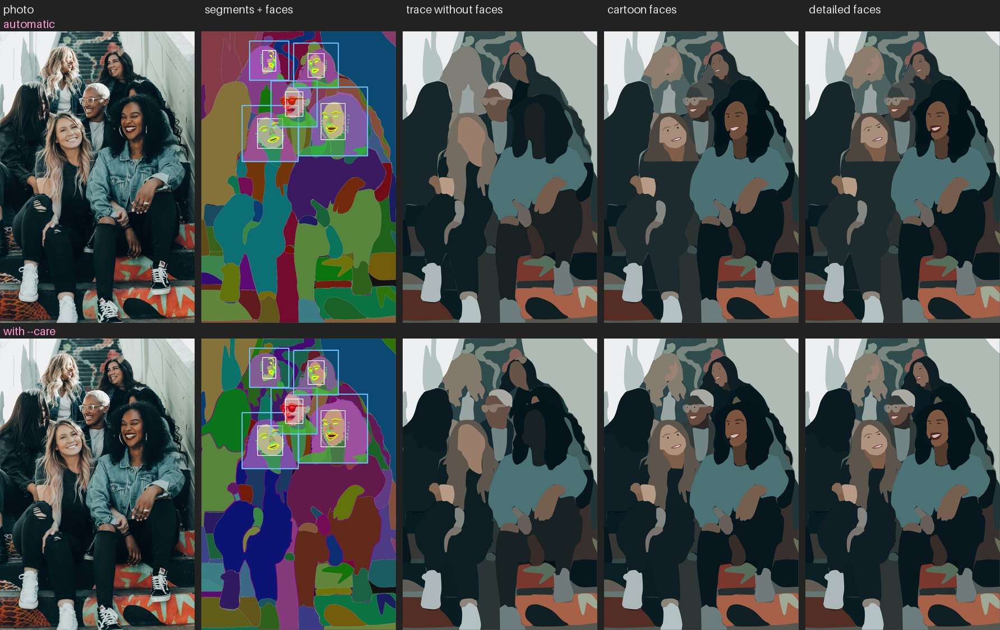
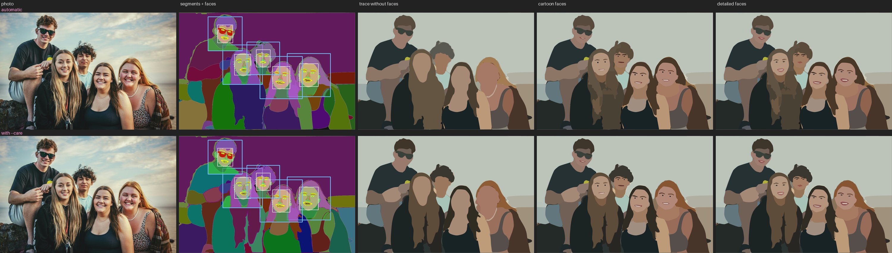
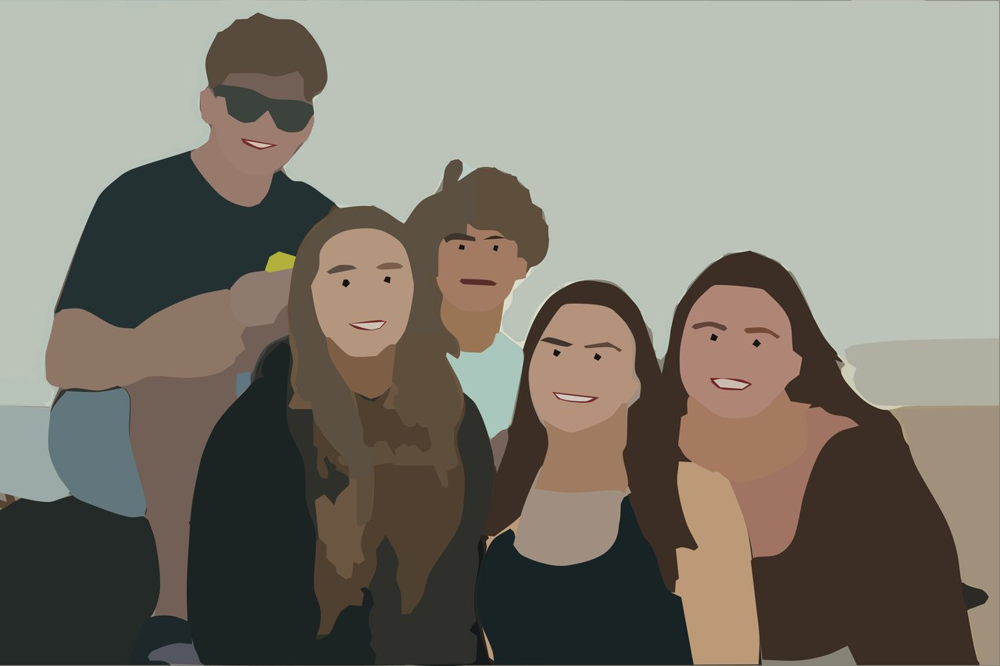
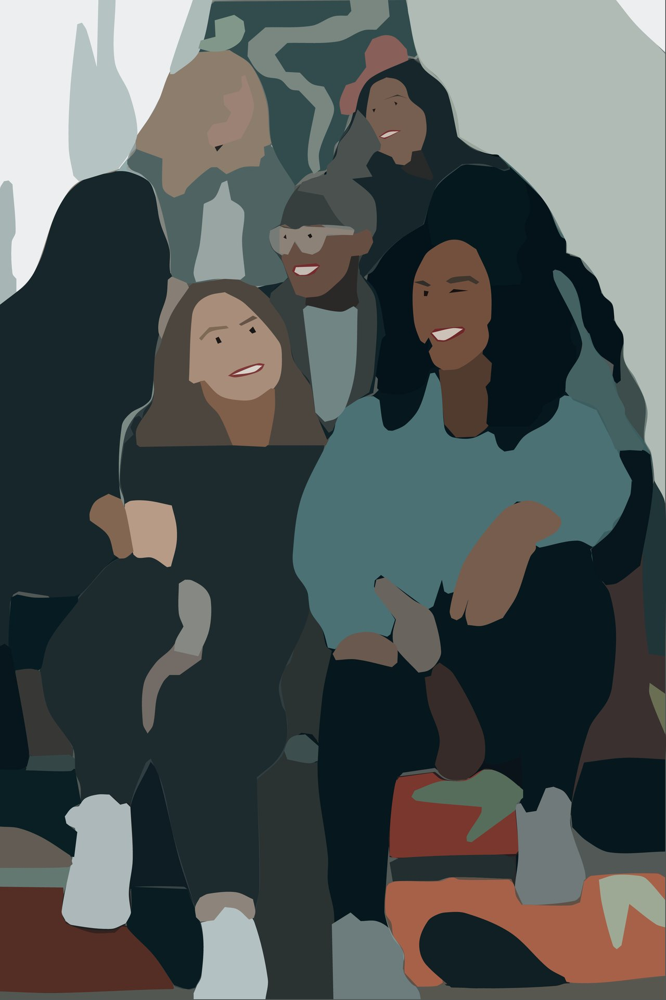
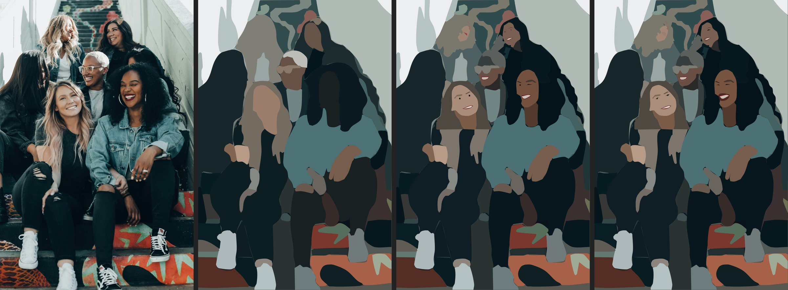
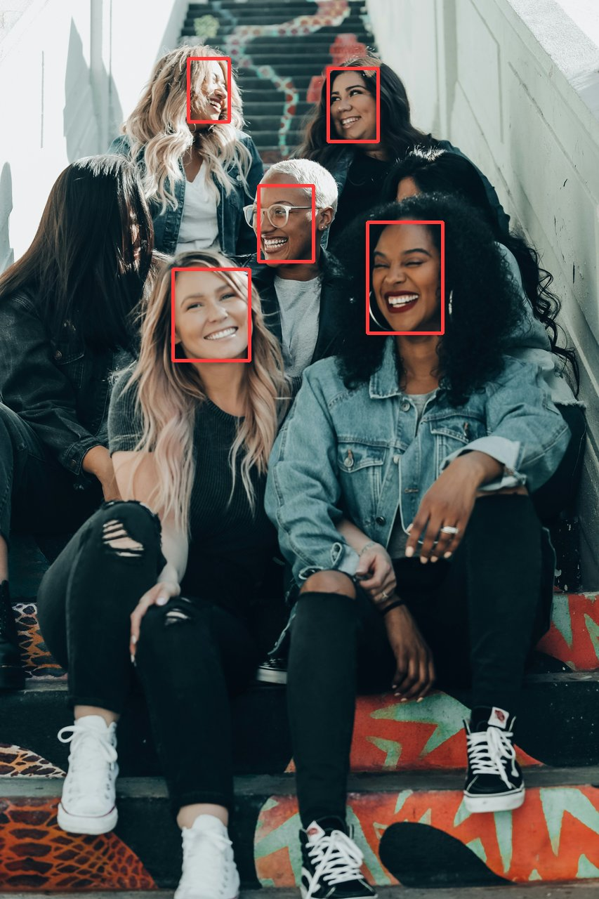
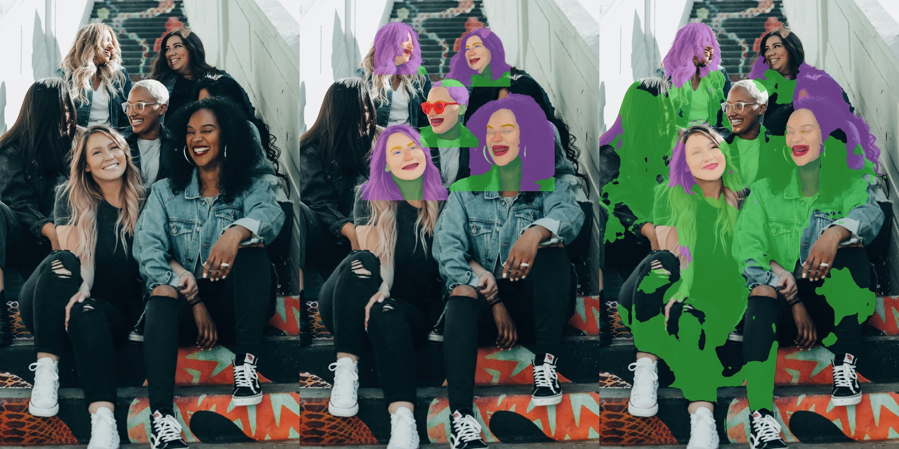

# Faces

SAM cannot resolve an eye a few pixels wide, so faces come out of a trace as blank blobs. The faces stage is a
**second stage** that runs on a finished trace and draws eyes, brows, mouths, teeth, glasses and hair as their own
named shapes, from where the face models say each part is. The default style is a cartoon face: each eye a dot, the
mouth a line or a dark open shape with white teeth, thin brows, and no nose.


*photo · trace only · `--style cartoon` · `--style detailed`. Photo by [Tim Mossholder](https://unsplash.com/photos/hOF1bWoet_Q) on Unsplash.*

## Run it

```bash
uv sync --extra faces                                   # once: installs face-alignment; weights download on first use
uv run tracesmart trace photo.jpg -o out/ --max-side 1280
uv run --extra faces tracesmart faces photo.jpg out/masks.npz --max-side 1280      # writes out/faces/
uv run --extra faces tracesmart faces photo.jpg out/masks.npz --max-side 1280 --style detailed -o out/faces-detailed
```

The first run downloads about 0.65 GB for the face parser and 0.1 GB for the landmark and detector models. The face models read crops from the original photo, so small faces are sharp even in a downscaled trace (`--no-from-original` reads the trace image instead); shapes are drawn at the trace size. Use the same `--max-side` as the trace. The stage reads `masks.npz`, so the slow SAM stage is not repeated. `--layers` works as for `trace`.

Every shape it adds is an ordinary described shape whose name starts with `face`: `face-eye-81`, `face-teeth-84`,
`face-hair-60`. That makes them easy to select in Inkscape or Affinity, and the stage knows which shapes are its own:
it replaces those when you rerun it and never touches yours.

### With `--care` words

The stage works on a trace made with `--care` words (`person`, `hand`, `bag`, `coat`, `hair`, ...). Your shapes are left
alone and the face details overrule them where they overlap:

- the parts it draws (eyes, brows, mouth, teeth, glasses, and the face skin) go on top of your segments;
- if you described `hair`, `neck` or `face`, that shape is used as it is and the stage does not add its own hair, neck
  or skin over it;
- a care shape that is smaller than the face and overlaps it (a hand on a cheek) stays in front, as it should;
- you do not need words like `eyes`: the stage finds them itself.

The overview figures below show each photo twice, once automatic and once with these words.

## Reading the overview figures

`overview.jpg` in each example folder has one row for the automatic trace and, if there is one, a second row for the
same photo traced with `--care` words. The columns:

1. the photo;
2. the trace's segment map (every shape in its own colour) with, for every face RetinaFace finds, its **box**, the
   **face-parsing labels** inside that box, and the 68 **landmark points** (green if the stage trusts them, red if it
   rejects them, so a wrong landmark can be told from a wrong drawing);
3. the trace without faces;
4. cartoon faces;
5. detailed faces.

Parse colours: skin peach, nose salmon, brows orange, eyes blue, mouth dark red, lips pink, hair purple, glasses red,
neck and clothes green. Row 2 was traced with `--care "person, hand, bag, coat, hair"`.





## Examples

Two Unsplash group photos, traced at 1280 px (`--grid 48 --impact 3e-5 --rounds 3`) and then run through the stage.
Each folder has the photo, the three SVGs (`vector-trace.svg`, `vector-cartoon.svg`, `vector-detailed.svg`), the
panels, and the step figures used below. Credits are in [../examples/README.md](../examples/README.md).

| Example | Faces | |
|---|---|---|
| [lake-friends](../examples/faces/lake-friends/) | 5, sunglasses, 100 to 140 px |  |
| [stairs](../examples/faces/stairs/) | 5, clear glasses, a laughing face, a turned head, 58 to 110 px |  |



*Photo by [Joel Muniz](https://unsplash.com/photos/HvZDCuRnSaY) on Unsplash.*

## How it works

1. **Find the faces.** (The models read the original photo from here on; detection runs on the trace image.) RetinaFace (through `face-alignment`) gives a tight box per face. Boxes under 24 px are ignored.
   It needs no gated model. SAM 3 prompted with "face" also found a mostly hidden 20 px face that RetinaFace missed,
   and BlazeFace missed several faces, so RetinaFace is the detector.

   

2. **Parse each face.** A SegFormer face parser (`jonathandinu/face-parsing`, trained on CelebAMask-HQ) labels every
   pixel of a crop: skin, hair, neck, brows, eyes, the inside of the mouth, lips, glasses. It is trained on face
   crops. Run on a whole image it keeps long hair complete but breaks small faces and mislabels clothes. Stitched from
   per-face crops it gives good faces but cuts hair and neck at straight crop edges. So the features come from a
   tight crop, and hair and neck also use a wider crop and a whole-image pass.

   

3. **Find the landmarks.** FAN (68 points) places the eyes and says whether each is closed, and gives the mouth line
   and brows on faces too small for the parse. Landmarks go wrong on a turned or occluded head, so they are only used
   when the eyes are a sensible distance apart, the nose sits between them and most key points land on parsed skin.
4. **Draw each part by rule**, parse first on faces of 60 px and up, landmarks as the fallback. Parts are drawn from
   their positions, not traced from pixels:
   - eyes: a dot at the eye, or an arc where the landmarks say it is shut (laughing, squinting);
   - brows and a closed mouth: a thin, smooth stroke along the middle of the parsed brow or lips;
   - an open mouth: the parsed inside of the mouth, with the teeth as that shape pulled in from the lips;
   - glasses: the parsed region as one solid shape;
   - hair, neck, skin: the parsed regions (the parsed nose is part of the skin and never a shape).
5. **Colour and stack.** Colours are sampled from the photo, then nudged towards what a part must look like (teeth
   towards white, eyes towards black, an open mouth towards dark red; hair uses its darker pixels, because the parse
   covers gaps between curls; clear glasses take the colour of the frame). Each face's hair, neck and skin go just
   above the last larger shape that covers them, and the trace's own duplicate shapes are removed so they do not peek
   out as slivers. The parts go on top.

Every step for every face, left to right: photo crop, parsing, landmarks, cartoon, detailed:


The other faces are in `steps/` in each example folder.

## What is drawn at each size

Face size is the shorter side of the detected box on the processed image.

| Face size | Drawn | From |
|---|---|---|
| under 40 px | hair, neck, skin, brows | parse for hair and skin, landmarks for brows |
| 40 to 60 px | adds eye dots and a mouth line or open mouth | landmarks |
| 60 px and over | brow strokes, open mouth with teeth or a mouth line, eye dots, glasses | parse first, landmarks as fallback |
| 80 px and over | detailed style only: eye whites, irises, pupils, lids, lips | parse and landmarks |
| any size | glasses, when the parser finds them | parse only |
| never | nose | left inside the skin shape |

## Limits

- **Turned heads** that fail the landmark checks get only hair, neck, skin and whatever the parse alone supplies.
- **Hair the parser reads as clothing** (long hair over a shoulder) can still end in a flat edge.
- **Glasses** are one solid shape. A clear pair hides detail behind it: in [`stairs/steps/face-3.jpg`](../examples/faces/stairs/steps/face-3.jpg) the
  eyes are only small dots on the glasses and the detailed style looks the same as the cartoon one.
- **Small, blurry faces** (about 60 px) give a noisy parse; below 40 px only brows are drawn.
- Tested by eye on these two photos and one 60 px family photo, not against a benchmark.

## Benchmark on eight more photos

`benchmarks/faces_bench.py` runs the stage over a folder of photos (trace, then both styles) and writes a table, a
contact sheet and an `overview.jpg` per photo. Run on eight Unsplash group photos (61 faces) by Attareza Naufal, Joel
Mott, Jud Mackrill, Manny Moreno, Mattia Revelant, Omar Lopez and Vitaly Gariev (two), traced at 1280 px with
`--grid 32 --rounds 2`, once automatic and once with `--care "person, hand, bag, coat, hair"`:

| photo | faces | eyes | mouths | teeth | glasses | own hair, auto | own hair, care | seconds, auto |
|---|---|---|---|---|---|---|---|---|
| attareza-naufal | 11 | 20 | 10 | 0 | 0 | 11 | 0 | 22.6 |
| joel-mott (crowd) | 22 | 38 | 21 | 10 | 2 | 22 | 8 | 34.8 |
| jud-mackrill | 4 | 6 | 4 | 4 | 1 | 4 | 1 | 6.0 |
| manny-moreno | 4 | 4 | 4 | 0 | 2 | 3 | 3 | 6.0 |
| mattia-revelant | 4 | 4 | 2 | 0 | 0 | 4 | 1 | 4.7 |
| omar-lopez | 10 | 20 | 10 | 0 | 2 | 10 | 3 | 13.3 |
| vitaly-gariev (selfie) | 5 | 10 | 5 | 1 | 0 | 5 | 3 | 6.9 |
| vitaly-gariev (from below) | 1 | 0 | 0 | 0 | 1 | 1 | 1 | 1.6 |
| **total** | **61** | **102** | **56** | **15** | **8** | **60** | **20** | **95.9** |

- **What was drawn.** 102 of a possible 122 eye shapes and 56 mouths for 61 faces. The gaps are far or turned faces,
  and faces seen from behind or below, which get little by design (see the size tiers above).
- **Care words.** With `hair` among them, the stage added its own hair on 20 faces instead of 60, because your care
  hair already covered the rest. The eyes, mouths and teeth are identical in both runs: the face parts go on top of
  whatever the care words segmented.
- **Time.** The stage took 96 s for the 61 faces (about 1.6 s per face; the first style of each photo carries some GPU
  warm-up). The base traces took 105 to 161 s each, so the stage is a small share of a run.
- **What it does not say.** These counts say what was drawn, not whether it is right: there is no ground truth, and
  the glasses count was not checked shape by shape. Judge quality on the overview figures. Two bugs came out of this
  run and are fixed: eye dots that were far too large in a crowd (a crop holds neighbouring faces, and parts must come
  from the face's own box), and landmarks rejected on every face wearing glasses (the eyes sit on glasses pixels,
  which the trust check did not count as face).

## Speed and memory

Measured on an Apple M2: the parser on the GPU, FAN on the CPU, five faces per photo.

| Step (seconds) | Stairs, 853 x 1280 | Lake, 1280 x 853 |
|---|---|---|
| Face detection | 0.1 | 0.1 |
| Parsing the face crops (10 passes) | 2.5 | 2.5 |
| Whole-image hair parse | 0.9 | 0.9 |
| Landmarks | 0.6 | 0.6 |
| Drawing the parts | 1.9 | 1.9 |
| Placing shapes in the stack | 2.2 | 1.3 |
| **Faces stage, warm** | **8.1** | **7.3** |
| Faces stage, cold (models load) | 16.3 | 15.4 |
| Rendering the SVG and PNGs | 1.2 | 0.9 |

Peak memory was about 1.7 GB. That is about 1.5 s per face against minutes for the SAM trace. The drawing and the shape
comparisons work on full-size masks; restricting them to each face's bounding box is the obvious saving.

## Regenerating the examples

```bash
uv run --extra faces python benchmarks/make_face_examples.py
```

Expects `outputs/tim/` and `outputs/joel/` (the plain traces) with `faces/` and `faces-detailed/` inside, made with the
commands above on the downscaled photos. Development notes, dead ends (face parsing alone, MediaPipe on Python 3.13,
Sapiens2) and the model choices are in [DEVELOPMENT.md](DEVELOPMENT.md#faces-tracesmart-faces-srctracesmartfacespy).
